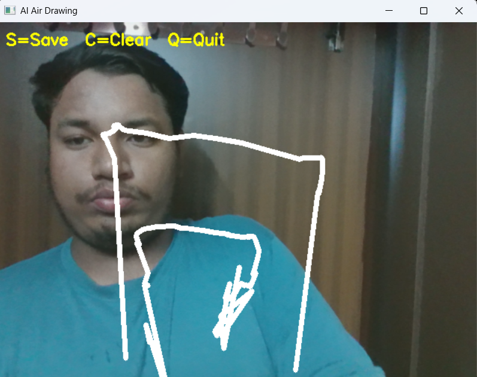
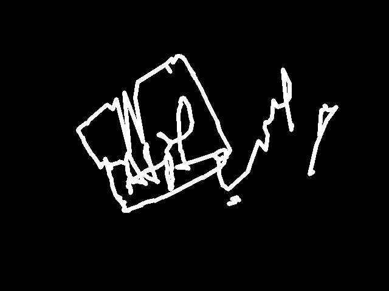
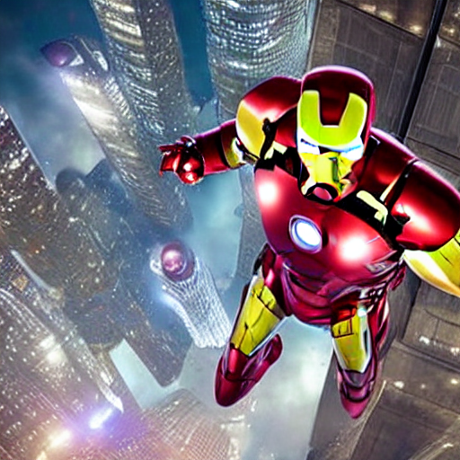

# AI Air Sketch to Image Generator

## Overview

AI Air Sketch to Image Generator is a Computer Vision and Generative AI project that allows users to draw in the air using hand gestures and generate AI-powered images.

## Project Demo

### Air Drawing

### Saved Sketch

### AI Generated Image

## Technologies Used

- Python
- OpenCV
- MediaPipe
- NumPy
- Stable Diffusion
- Hugging Face
- Computer Vision
- Generative AI

## Author

Atif Md
